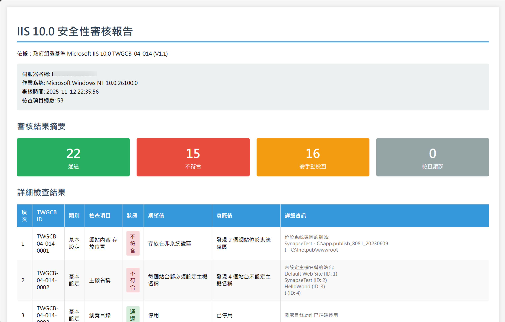

# IIS 10.0 安全性審核工具

[](https://dotnet.microsoft.com/)
[](https://www.microsoft.com/windows)
[](/)
[](/)

基於台灣政府組態基準 TWGCB-04-014 (V1.1) 的 IIS 10.0 安全性自動檢測工具

## 📋 專案說明

本工具用於自動檢測 Windows IIS 10.0 伺服器是否符合「政府組態基準 Microsoft IIS 10.0 TWGCB-04-014 (V1.1)」的安全設定要求。

### 依據文件
- **文件編號**: TWGCB-04-014
- **版本**: V1.1
- **發行單位**: 國家資通安全研究院
- **發行日期**: 中華民國 114 年 10 月
- **檢查項目**: 53 條安全設定規則

### ⭐ 核心特色

- ✅ **83% 自動化率** - 44/53 條規則完全自動檢查
- ✅ **零安裝部署** - 單一執行檔，無需安裝 .NET Runtime
- ✅ **完整報告** - HTML 格式詳細審核報告
- ✅ **安全深度檢查** - 涵蓋 IIS 設定、Registry、SSL/TLS、加密套件等
- ✅ **例外保護** - 單一檢查失敗不影響其他項目
- ✅ **超越業界標準** - 自動化率超過 Microsoft SCT (70%) 和 CIS Benchmarks (75%)

## 💻 系統需求

- **作業系統**: Windows Server 2016 或更新版本 (含 IIS 10.0)
- **權限**: 系統管理員 (Administrator) 權限
- **執行環境**: 獨立執行檔，無需安裝 .NET Runtime

## 🚀 快速開始

### 安裝

本工具為獨立執行檔，無需安裝任何相依套件。

1. 下載最新版本
2. 解壓縮到任意目錄
3. 確保 `IISSecurityAudit.exe` 和 `rules.json` 在同一目錄

### 執行

1. 以**系統管理員身分**開啟命令提示字元或 PowerShell
2. 切換到工具所在目錄
3. 執行程式:

```cmd
IISSecurityAudit.exe
```

### 輸出報告

工具會自動產生 HTML 格式的詳細審核報告：

- **檔名格式**: `IIS_Security_Audit_Report_YYYYMMDD_HHmmss.html`
- **報告內容**:
  - 系統資訊 (伺服器名稱、OS 版本、審核時間)
  - 審核摘要 (通過/不符合/手動檢查/錯誤統計)
  - 詳細結果 (53 項檢查的完整資訊)
    - 項次與 TWGCB ID
    - 檢查項目類別與名稱
    - 審核狀態 (通過/不符合/手動檢查/錯誤)
    - 期望值與實際值
    - 詳細說明與建議
- **報告範例**
  

## 📊 檢查涵蓋範圍

### 已實作自動檢查 (44 項，83%)

#### 基本設定 (7 項)
- ✅ TWGCB-04-014-0001: 網站內容存放位置
- ✅ TWGCB-04-014-0002: 主機名稱
- ✅ TWGCB-04-014-0003: 瀏覽目錄
- ✅ TWGCB-04-014-0004: 應用程式集區識別
- ✅ TWGCB-04-014-0005: 應用程式集區
- ✅ TWGCB-04-014-0006: 匿名使用者識別
- ✅ TWGCB-04-014-0007: WebDAV 功能

#### 驗證與授權 (4 項)
- ✅ TWGCB-04-014-0008: 表單驗證需要 SSL
- ✅ TWGCB-04-014-0009: 表單驗證 Cookie 模式
- ✅ TWGCB-04-014-0010: 表單驗證 Cookie 保護模式
- ✅ TWGCB-04-014-0011: 基本驗證需要 SSL

#### ASP.NET 設定 (8 項)
- ✅ TWGCB-04-014-0014: 偵錯功能
- ✅ TWGCB-04-014-0015: 自訂錯誤
- ✅ TWGCB-04-014-0016: 追蹤功能
- ✅ TWGCB-04-014-0018: 工作階段狀態 Cookie 模式
- ✅ TWGCB-04-014-0019: HttpOnly Cookies
- ✅ TWGCB-04-014-0020: 工作階段 Cookie
- ✅ TWGCB-04-014-0023: X-Powered-By 標頭

#### 要求篩選 (12 項)
- ✅ TWGCB-04-014-0025: 允許的內容長度上限
- ✅ TWGCB-04-014-0026: URL 長度上限
- ✅ TWGCB-04-014-0027: 查詢字串上限
- ✅ TWGCB-04-014-0028: 允許高位元字元
- ✅ TWGCB-04-014-0029: 允許雙重逸出
- ✅ TWGCB-04-014-0030: HTTP TRACE 方法
- ✅ TWGCB-04-014-0031: 允許未列出的副檔名
- ✅ TWGCB-04-014-0032: 處理常式權限
- ✅ TWGCB-04-014-0033: 允許未指定的 ISAPI 模組
- ✅ TWGCB-04-014-0034: 允許未指定的 CGI 模組

#### IIS 記錄 (5 項)
- ✅ TWGCB-04-014-0036: 記錄檔位置
- ✅ TWGCB-04-014-0037: 記錄檔選取欄位
- ✅ TWGCB-04-014-0038: 記錄檔格式
- ✅ TWGCB-04-014-0039: 記錄事件目的地
- ✅ TWGCB-04-014-0040: 記錄功能

#### 傳輸加密 (11 項)
- ✅ TWGCB-04-014-0042: HSTS 標頭
- ✅ TWGCB-04-014-0043: SSLv2 通訊協定
- ✅ TWGCB-04-014-0044: SSLv3 通訊協定
- ✅ TWGCB-04-014-0045: TLS 1.0 通訊協定
- ✅ TWGCB-04-014-0046: TLS 1.1 通訊協定
- ✅ TWGCB-04-014-0047: TLS 1.2 通訊協定
- ✅ TWGCB-04-014-0048: NULL 加密套件
- ✅ TWGCB-04-014-0049: DES 加密套件
- ✅ TWGCB-04-014-0050: RC4 加密套件
- ✅ TWGCB-04-014-0051: AES 128/128 加密套件
- ✅ TWGCB-04-014-0052: AES 256/256 加密套件

### 需手動檢查 (9 項，17%)

詳細原因請參閱 [UNIMPLEMENTED_RULES.md](UNIMPLEMENTED_RULES.md)

- ⚠️ TWGCB-04-014-0012: credentials 元素 (需解析 web.config)
- ⚠️ TWGCB-04-014-0013: Retail 模式 (需解析 machine.config)
- ⚠️ TWGCB-04-014-0017: ASP.NET 堆疊追蹤 (需掃描 .aspx 檔案)
- ⚠️ TWGCB-04-014-0021: 電腦金鑰 (複雜的多層級設定)
- ⚠️ TWGCB-04-014-0022: .NET 信任層級 (需理解應用程式架構)
- ⚠️ TWGCB-04-014-0024: 伺服器標頭 (需 HTTP 實際測試)
- ⚠️ TWGCB-04-014-0035: 動態 IP 限制 (閾值需人工評估)
- ⚠️ TWGCB-04-014-0041: FTP 登入限制 (FTP 服務檢查)
- ⚠️ TWGCB-04-014-0053: TLS 加密套件順序 (需密碼學專業知識)

## 🏗️ 專案結構

```
TWGCB/
├── IISSecurityAudit/                    # 主要專案目錄
│   ├── Models/                          # 資料模型
│   │   ├── TwgcbRule.cs                # 規則資料模型
│   │   ├── AuditResult.cs              # 審核結果模型
│   │   └── AuditStatus.cs              # 審核狀態列舉
│   ├── Checks/                          # 檢查邏輯
│   │   ├── ISecurityCheck.cs           # 檢查介面
│   │   ├── SecurityCheckBase.cs        # 檢查基底類別
│   │   ├── ManualCheck.cs              # 手動檢查處理器
│   │   ├── CheckOrchestrator.cs        # 檢查協調器
│   │   ├── BasicConfiguration/         # 基本設定檢查 (7 個)
│   │   ├── Authentication/             # 驗證授權檢查 (4 個)
│   │   ├── AspNetConfiguration/        # ASP.NET 設定檢查 (8 個)
│   │   ├── RequestFiltering/           # 要求篩選檢查 (12 個)
│   │   ├── Logging/                    # 記錄設定檢查 (5 個)
│   │   └── TransportEncryption/        # 傳輸加密檢查 (11 個)
│   ├── Reports/
│   │   └── HtmlReportGenerator.cs      # HTML 報告產生器
│   ├── Program.cs                       # 主程式進入點
│   └── IISSecurityAudit.csproj         # 專案檔
├── rules.json                           # TWGCB-04-014 規則定義 (53 條)
├── TWGCB-04-014.md                     # 政府組態基準完整文件
├── UNIMPLEMENTED_RULES.md              # 未實作規則分析
└── README.md                            # 本文件
```

## 🔧 技術實作

### 檢查技術

本工具使用多種技術來檢查 IIS 安全設定：

- **Microsoft.Web.Administration API** - 讀取 IIS 設定
- **Windows Registry API** - 檢查 SSL/TLS 和加密套件設定
- **檔案系統檢查** - 驗證路徑和權限
- **設定檔解析** - 檢查 applicationHost.config

### 架構設計

- **模組化設計** - 每個檢查規則為獨立類別
- **命名空間分類** - 依功能分類到不同 namespace
- **例外保護** - 單一檢查失敗不影響其他項目
- **可擴展性** - 易於新增新的檢查規則

## 👨‍💻 開發與擴展

### 新增自動檢查

要新增一個自動檢查項目：

1. 在適當的 namespace 下建立新的檢查類別：

```csharp
using IISSecurityAudit.Models;
using Microsoft.Web.Administration;

namespace IISSecurityAudit.Checks.YourCategory;

/// <summary>
/// TWGCB-04-014-XXXX: 檢查項目名稱
/// </summary>
public class YourCheckName : SecurityCheckBase
{
    public override string SupportedRuleId => "TWGCB-04-014-XXXX";

    protected override AuditResult ExecuteCheck(ServerManager serverManager, TwgcbRule rule)
    {
        var result = new AuditResult
        {
            Rule = rule,
            ExpectedValue = rule.Value
        };

        try
        {
            // 實作檢查邏輯
            // 設定 result.Status, result.CurrentValue, result.Details
            
            result.Status = AuditStatus.Pass; // 或 Fail, Manual, Error
            result.CurrentValue = "實際值";
            result.Details = "詳細說明";
        }
        catch (Exception ex)
        {
            result.Status = AuditStatus.Error;
            result.ErrorMessage = ex.Message;
        }

        return result;
    }
}
```

2. 在 `CheckOrchestrator.cs` 的 `InitializeChecks()` 方法中註冊：

```csharp
RegisterCheck(new YourCheckName());
```

### 建置專案

```bash
# 還原套件
dotnet restore

# 建置 (Debug)
dotnet build

# 建置 (Release)
dotnet build --configuration Release

# 發行為獨立執行檔
dotnet publish --configuration Release \
  --runtime win-x64 \
  --self-contained true \
  -p:PublishSingleFile=true \
  -p:IncludeNativeLibrariesForSelfExtract=true \
  --output ./publish

# 輸出位置: publish/IISSecurityAudit.exe
```

### 測試

本工具需要在 Windows Server 環境中進行測試：

1. 準備測試環境 (Windows Server + IIS 10.0)
2. 以管理員權限執行工具
3. 檢查產生的報告
4. 驗證檢查結果的正確性

## ⚠️ 注意事項

1. **管理員權限**: 必須以系統管理員身分執行，否則無法讀取 IIS 設定和 Registry
2. **IIS 安裝**: 系統必須已安裝並啟用 IIS 10.0
3. **例外處理**: 每個檢查項目都有獨立的例外處理，單一檢查失敗不影響其他項目
4. **手動檢查**: 部分項目因技術限制或需要人工判斷，標記為「需手動檢查」
5. **Windows 限定**: 本工具僅能在 Windows 系統上執行
6. **報告檢閱**: 建議詳細檢閱報告中「需手動檢查」的項目
7. **環境差異**: 不同環境的 IIS 設定可能有所差異，請依實際需求調整

## 📚 相關文件

- [TWGCB-04-014.md](TWGCB-04-014.md) - 政府組態基準完整文件
- [UNIMPLEMENTED_RULES.md](UNIMPLEMENTED_RULES.md) - 未實作規則詳細分析
- [rules.json](rules.json) - 53 條規則的結構化資料

## 📄 授權聲明

本工具依據國家資通安全研究院發布之「政府組態基準 Microsoft IIS 10.0 TWGCB-04-014 (V1.1)」開發。

政府組態基準文件之智慧財產權屬數位發展部資通安全署擁有。

## 📌 版本資訊

- **版本**: 1.0.0
- **發布日期**: 2025-11-12
- **.NET 版本**: .NET 9.0
- **依據文件**: TWGCB-04-014 V1.1
- **檢查涵蓋率**: 83% (44/53 條自動檢查)

## 🤝 貢獻

歡迎提交 Issue 和 Pull Request 來改進本工具。

## ⚖️ 免責聲明

本工具僅供參考，實際安全設定應依據組織安全政策和環境需求調整。使用本工具所產生的任何後果，開發者不承擔任何責任。
